# All-Local Live Stream AI Co-Host System Summary

## 1. Executive Summary & Objective

This project implements a high-performance, low-latency live stream AI co-host pipeline ("Nova" / "I Am") operating **entirely locally on the OBS host machine**.

All processing—including local speech-to-text transcription tailing, YouTube Live chat ingestion, Google Gemini LLM streaming, 48kHz neural text-to-speech (TTS), GPU-accelerated 1080p60 Pygame visualizer rendering, OBS WebSocket automation, native Windows audio playback (for OBS Window/Application Audio Capture), and local NDI video/audio broadcasting (`"AI_COHOST_FEED"`)—runs within a single, highly optimized local Python process.

---

## 2. All-Local Architecture & Data Flow

```mermaid
flowchart TD
    subgraph OBS_HOST["OBS Host Machine (All-Local In-Memory Architecture)"]
        MIC["Host Microphone"] --> TRANS["OBS Speech Filter / LocalVocal"]
        TRANS --> GDI["OBS GDI+ Text Source"]
        YT["YouTube Live API / pytchat"] --> CHAT["Live Chat Feed"]

        APP["Master Orchestrator (app.py)"]
        GDI -->|Local OBS WebSocket :4455| APP
        CHAT --> APP

        BRAIN["AI Brain (Gemini 3.7 Flash)"]
        TTS["TTS Engine (edge-tts / 48kHz Resampler)"]
        VIS["Visualizer (1080p60 GPU Pygame Canvas)"]
        NDI["NDI Broadcaster (cyndilib / AI_COHOST_FEED)"]

        APP --> BRAIN
        BRAIN -->|Streaming Chunks & Moods| VIS
        BRAIN -->|Streaming Sentences| TTS
        TTS -->|48kHz Stereo Audio Queue| NDI
        TTS -->|48kHz Stereo Audio Queue| WIN_AUDIO["Windows Local Audio (sounddevice / WASAPI)"]
        TTS -->|FFT Spectrum & RMS Amplitude| VIS
        VIS -->|1080p60 RGBA Frame Buffer| NDI

        OBS_WIN["OBS Window Capture / Application Audio Capture"]
        OBS_NDI["OBS NDI Source (DistroAV)"]
        
        VIS -->|Desktop Window| OBS_WIN
        WIN_AUDIO -->|Process Audio Session| OBS_WIN
        NDI -->|Direct NDI Feed| OBS_NDI
        APP -->|Direct Scene FX / Media Trigger| OBS_WIN
        APP -->|Direct Scene FX / Media Trigger| OBS_NDI
    end
```

---

## 3. End-to-End Execution Sequence

1. **Context Ingestion on OBS Host**:
   - Host/guest speaks -> OBS speech filter / LocalVocal updates OBS GDI+ text source.
   - `app.py` directly polls OBS text source via local WebSocket (`localhost:4455`).
   - Live viewer chat arrives via `pytchat` (with Superchat & badge detection).
2. **AI Reasoning & Context Management**:
   - `ai_brain.py` filters spam, preserves member-to-member entanglement by skipping peer replies (`@OtherMember`), evaluates trigger conditions (host direct address, questions, chat mentions, superchats, interjection cooldowns), and initiates streaming Gemini inference.
   - During quiet stream lulls, the Spontaneous Reflection Engine automatically delivers extended spiritually illuminating commentaries and non-dual insights.
   - The first token returns a mood tag (`[MOOD: savage]`, `hyped`, `chill`, `energetic`, `mysterious`, `thoughtful`, `snarky`), immediately triggering a smooth color/motion transition on the visualizer.
3. **Pipelined TTS & Audio Analysis**:
   - As Gemini streams tokens, `ai_brain.py` detects completed sentence boundaries and forwards them to `tts_engine.py`.
   - `tts_engine.py` synthesizes 48kHz stereo float32 PCM audio in memory.
   - Audio is buffered into a synchronized queue.
4. **Frame-Locked 60 FPS Clock Loop & Dual Audio Routing**:
   - At every 1/60s tick (~16.67ms), the pipeline renders 1080p60 RGBA video frames.
   - A dedicated high-priority 50Hz OS thread pops 960 audio samples (20ms at 48kHz) and delivers them **simultaneously** to:
     1. Local NDI stream (`AI_COHOST_FEED`) for OBS NDI sources.
     2. Native Windows audio output via `sounddevice` (WASAPI), enabling direct audio capture when using OBS **Window Capture** (with "Capture Audio" enabled) or **Application Audio Capture**.
5. **OBS Reception**:
   - OBS Studio on the local machine can capture the co-host using either:
     - **Option 1 (Windows Native)**: Window Capture + Application Audio Capture (no extra plugins required).
     - **Option 2 (NDI)**: NDI Source via DistroAV with 0ms network latency.

---

## 4. Technical Specifications & Design Decisions

| Parameter | Specification | Technical Rationale |
| :--- | :--- | :--- |
| **Architecture** | All-Local In-Memory Single PC | Zero network overhead, zero cross-machine latency, single command startup. |
| **OBS Integration** | Dual: Window/App Audio Capture + NDI | Works natively in OBS without plugins, or via DistroAV NDI. |
| **Video Resolution & Rate** | 1920x1080 @ 60.00 FPS (or 1080x1920 @ 60fps) | Broadcast standard; matches high-motion streaming layouts. |
| **Audio Format & Clocking** | 48,000 Hz Stereo Float32 Planar + Interleaved | Simultaneous NDI planar feed + Windows WASAPI output; 20ms packets yield exact 1:1 AV sync. |
| **LLM Inference** | Gemini 3.7 Flash (Native Async Streaming) | Sub-second token time-to-first-byte (TTFB) with `thinking_level=LOW` enables natural, punchy conversational turns. |
| **Mood Tagging System** | Regex `[MOOD: <name>]` | First-token extraction adjusts visualizer shader palette before speech begins. |
| **Visualizer Tech** | Pygame + NumPy Vectorization | Achieves 65-250+ FPS at 1080p without dedicated 3D engine overhead. |
| **Fault Tolerance** | Auto-reconnect & Token Protection | Eco/Standby modes prevent token burn; automated reconnect for OBS and YouTube. |
